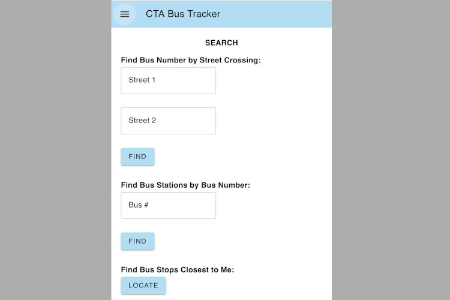
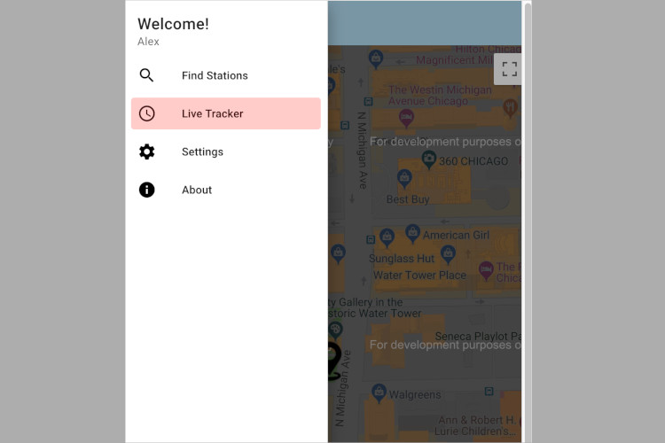
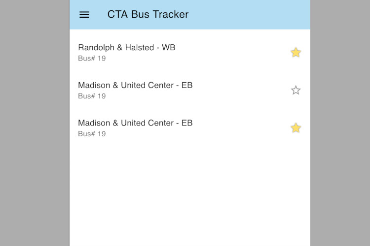
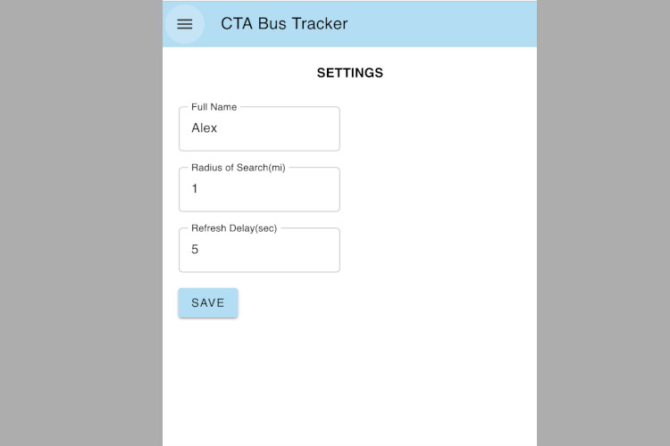
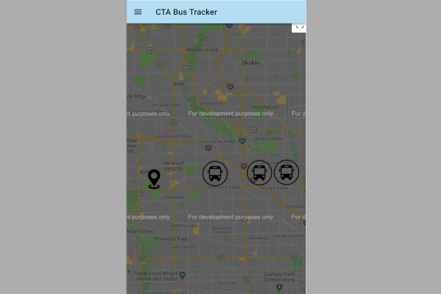
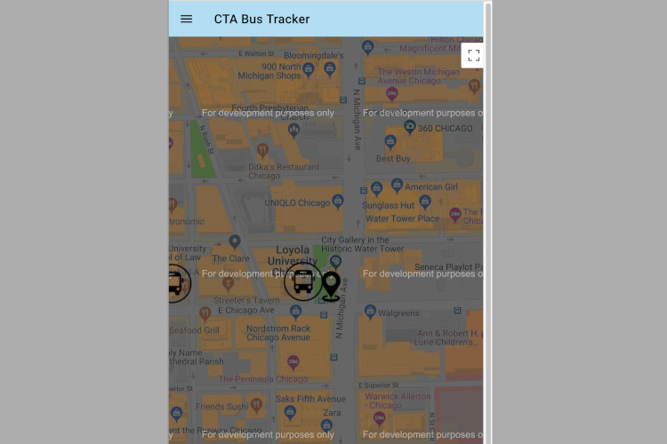

# cta-bus-tracker
CTA Bus Tracker

This application provides live data of the CTA buses locations based on selected bus stop and bus number. Moreover, user can save his/her favorite bus stops for quick track, change radius of bus stop search based on his/her location, and change frequency of data update on Google Maps. This is PWA application and can be installed on users device and work offline (live data is not available without internet connection, search by bus number and street cossing only). 

